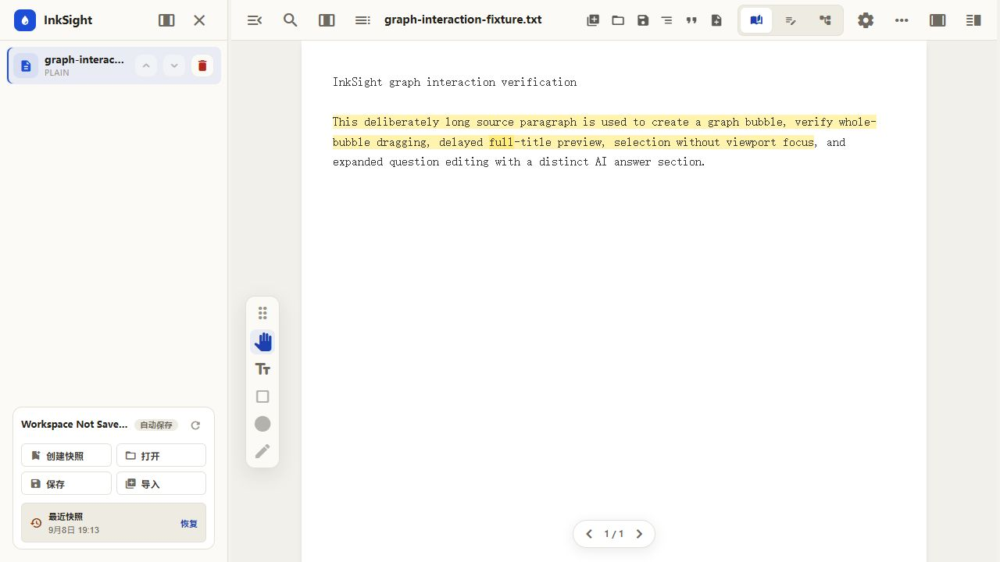
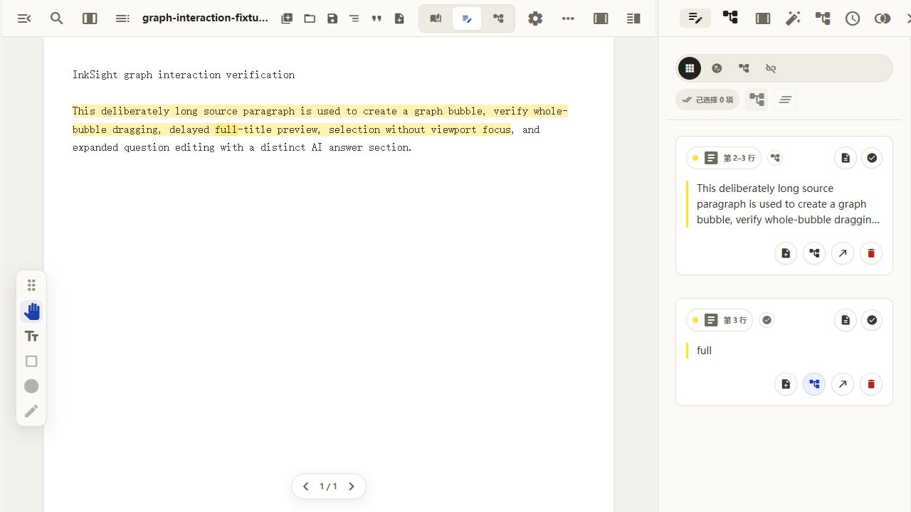
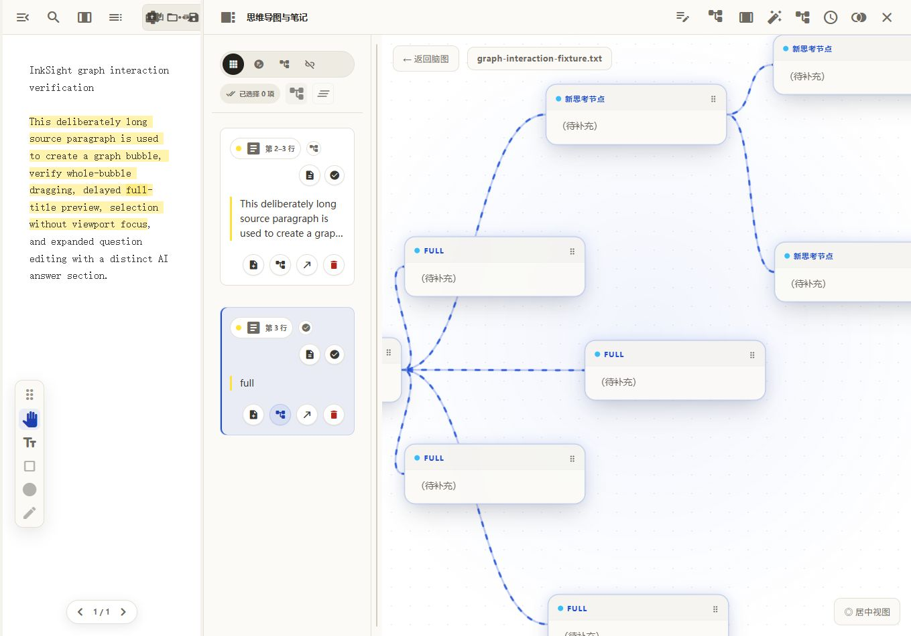
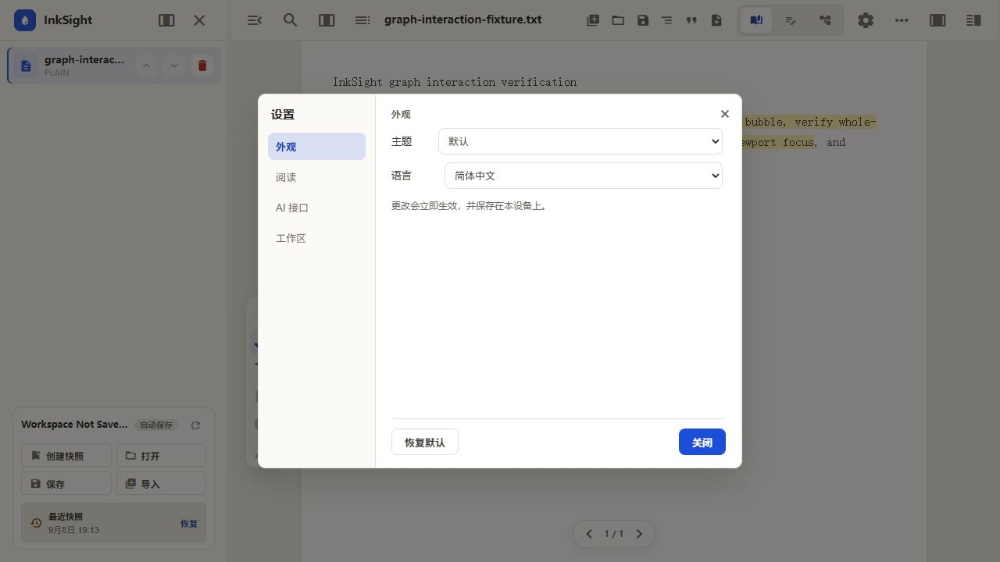

# InkSight 🖋️

> **Read deeply, think clearly.**
> A modern Web application integrating deep reading, mind mapping, and knowledge management.

[](./LICENSE)
[](https://github.com/MrmoLabs/InkSight/releases)

[中文](./README_ZH.md) | **English**

## 📖 Introduction

InkSight aims to solve the pain point of separation between "reading" and "thinking" in traditional reading tools. It seamlessly integrates a multi-format document reader (PDF/EPUB/Markdown) with an infinite canvas mind map, supporting **drag-and-drop node creation** and **bi-directional linking**. Whether you are conducting academic research by reading papers or building a knowledge system by reading technical books, InkSight helps you transform information into knowledge more efficiently.



## 🖼️ Product Tour

### Read and capture without leaving the document

Keep the source text visible while reviewing highlights, notes, trace-back status, and mind-map actions in the annotation panel.



### Turn passages into connected lines of thought

Open an annotation as a bubble graph, select a bubble before operating on it, double-click to expand it, and click a highlighted passage to locate the corresponding child bubble. Bubble selection, expansion, generated nodes, and text-to-child links are preserved in project snapshots.



### Work in Chinese or English

Switch the application language and visual theme from Settings. Changes take effect immediately and are stored on the current device.



## 🚀 Quick Start

### Requirements
- Node.js 22.12+
- npm or yarn

### Installation & Running

```bash
# 1. Clone the repository
git clone https://github.com/MrmoLabs/InkSight.git

# 2. Enter the directory
cd inksight

# 3. Install dependencies
npm install

# 4. Start the development server
npm run dev
```

Visit `http://localhost:5173` to start using it.

## 📚 Documentation

- **[Features](./docs/FEATURES.md)**: Detailed feature introduction.
- **[Architecture](./docs/ARCHITECTURE.md)**: Project structure, tech stack, and core module explanation.
- **[Roadmap](./docs/ROADMAP.md)**: Development motivation and future plans.
- **[Privacy](./PRIVACY.md)**: Local storage, AI data transmission, and API credential handling.
- **[Windows Packaging](./docs/PACKAGING.md)**: Build output and distribution instructions.

## ✨ Key Features

- **Multi-format Support**: PDF, EPUB, TXT, Markdown.
- **Immersive Reading**: A reading experience focused on content.
- **Visual Notes**: Generate mind map nodes directly by dragging content from documents.
- **Annotation List**: Dedicated interaction panel for managing highlights and notes with bidirectional sync.
- **Outline Navigation**: Integrated document outline sidebar for easy navigation.
- **Smart Layout**: Powerful automatic layout algorithms to clarify your train of thought with one click.
- **Bi-directional Tracing**: Click on a note node to instantly jump back to the original source in the text.
- **Interactive Bubble Graph**: Select, drag, expand, edit, branch, and regenerate thought bubbles while keeping clickable parent-to-child text links across reloads.
- **Bilingual Interface**: Switch the application shell and primary workflows between Simplified Chinese and English.
- **Privacy & Security**: Documents and projects stay on your device. Internet access is only required when you explicitly use a configured AI provider; prompts and related context are then sent to that provider.

## 📦 Packaging (Windows Application)

You can package InkSight as a self-contained Windows application directory that runs without a development server. The current build target is an unpacked directory, not a single-file installer.

### Build Executable

```bash
# Build the application
npm run dist:win

# The complete application directory will be generated at:
# dist/win-unpacked/InkSight.exe
```

Keep `InkSight.exe` together with the other files in `dist/win-unpacked/`. For distribution, zip the entire directory or download the equivalent ZIP from a GitHub Release.

## 🛠️ Tech Stack

- **Frontend**: React, Vanilla JS, Vite
- **Desktop**: Electron
- **Rendering**: PDF.js, Epub.js, Marked
- **Canvas**: [Plait (Drawnix)](https://github.com/plait-board/drawnix), Rough.js

## 🤝 Acknowledgements

- **[Drawnix](https://github.com/plait-board/drawnix)**: The core whiteboard engine of InkSight is built upon Drawnix. Special thanks to the Plait Board team for their excellent work.

---
*Created by MrmoLabs.*
