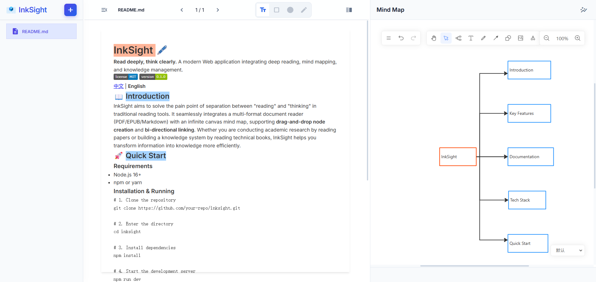

# InkSight 🖋️

**中文** | [English](./README.md)


> **Read deeply, think clearly.**
> 一个集成了深度阅读、思维导图与知识管理的现代化 Web 应用。

[](./LICENSE)
[](https://github.com/MrmoLabs/InkSight/releases)

## 📖 简介 (Introduction)

InkSight 旨在解决传统阅读工具“读”与“思”分离的痛点。它将多格式文档阅读器（PDF/EPUB/Markdown）与无限画布思维导图无缝集成，支持**拖拽创建节点**和**双向链接跳转**。无论你是通过阅读论文进行学术研究，还是阅读技术书籍构建知识体系，InkSight 都能帮助你更高效地将信息转化为知识。



## 🚀 快速开始 (Quick Start)

### 环境要求
- Node.js 22.12+
- npm or yarn

### 安装与运行

```bash
# 1. 克隆项目
git clone https://github.com/MrmoLabs/InkSight.git

# 2. 进入目录
cd inksight

# 3. 安装依赖
npm install

# 4. 启动开发服务器
npm run dev
```

访问 `http://localhost:5173` 即可开始使用。

## 📚 文档 (Documentation)

- **[功能清单 (Features)](./docs/FEATURES.md)**: 详细的功能介绍。
- **[技术架构 (Architecture)](./docs/ARCHITECTURE.md)**: 项目结构、技术栈与核心模块说明。
- **[背景与展望 (Roadmap)](./docs/ROADMAP.md)**: 开发初衷与未来计划。
- **[隐私说明 (Privacy)](./PRIVACY.md)**: 本地存储、AI 数据传输与 API 凭据处理方式。
- **[Windows 打包指南](./docs/PACKAGING.md)**: 构建产物与分发说明。

## ✨ 核心特性 (Key Features)

- **多格式支持**: PDF, EPUB, TXT, Markdown。
- **沉浸式阅读**: 专注于内容的阅读体验。
- **可视化笔记**: 从文档直接拖拽内容生成思维导图节点。
- **标注列表**: 专用的标注管理面板，支持查看、编辑标注并与文档双向同步。
- **大纲导航**: 集成文档大纲侧边栏，支持点击跳转和阅读进度自动定位。
- **智能排版**: 强大的自动布局算法，一键理清思维脉络。
- **双向溯源**: 点击笔记节点瞬间跳转回原文出处。
- **隐私安全**: 文档和项目保存在本机。仅当你主动使用已配置的 AI 服务时需要联网，届时提示词及相关上下文会发送给对应服务商。

## 📦 打包 (Windows 应用程序)

你可以将 InkSight 打包为无需开发服务器即可运行的完整 Windows 应用目录。当前构建目标是解包目录，而不是单文件安装程序。

### 构建可执行文件

```bash
# 构建应用程序
npm run dist:win

# 完整应用目录将生成于：
# dist/win-unpacked/InkSight.exe
```

`InkSight.exe` 必须与 `dist/win-unpacked/` 中的其他文件保持在一起。分发时请压缩整个目录，或从 GitHub Release 下载对应的 ZIP 包。

## 🛠️ 技术栈 (Tech Stack)

- **Frontend**: React, Vanilla JS, Vite
- **Desktop**: Electron
- **Rendering**: PDF.js, Epub.js, Marked
- **Canvas**: [Plait (Drawnix)](https://github.com/plait-board/drawnix), Rough.js

## 🤝 致谢 (Acknowledgements)

- **[Drawnix](https://github.com/plait-board/drawnix)**: InkSight 的核心白板引擎基于 Drawnix 构建。特别感谢 Plait Board 团队的杰出工作。

---
*Created by MrmoLabs.*
